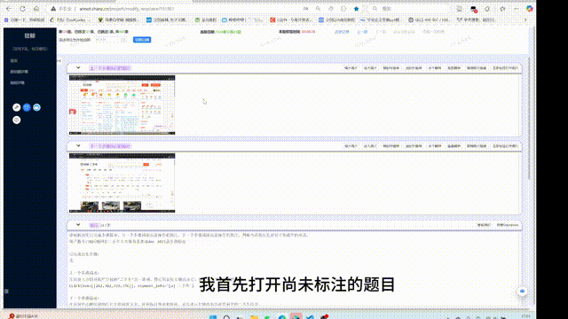

<h1 tabindex="-1" class="heading-element" dir="auto">WebImagesAutomaticallyCompare</h1></svg>

### This script is used to assist in manual tagging.

---

---

Use `Ctrl + H` to **Open**.

Use `Ctrl + B` to **Turn off**.

---

*You can watch the tutorial video by **clicking** on the Gif image above or [**here**](https://pan.baidu.com/s/14RaAgfdfjQKsbHBnRuDfFg).*

### Enjoy it!~🤗