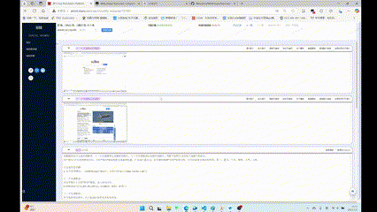

<h1 tabindex="-1" class="heading-element" dir="auto">WebImagesAutomaticallyCompare</h1></svg>
<h3>Bulit for Crazy Annotation</h3>

### This script is used to assist in manual tagging.

---
## New Feature

[v0.63]Now you can click on the image to enlarge it for a closer preview and view more intricate details.

---
[v0.63]Our first publicly released version supports image comparison, quick button selection, and adaptive interface features.

---

Use `Ctrl + H` to **Open**.

Use `Ctrl + B` to **Close**.

---

*You can watch the tutorial video by **clicking** on the Gif image above or [**here**](https://pan.baidu.com/s/14RaAgfdfjQKsbHBnRuDfFg?pwd=4321).*

### Enjoy it!~🤗
